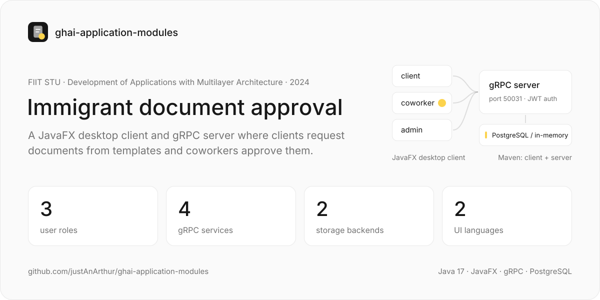
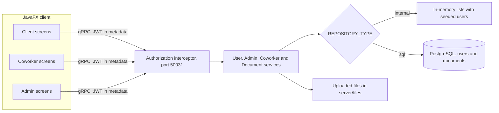

<a href="https://github.com/justAnArthur/ghai-application-modules"></a>

# GHAI: Government Help Application For Immigrants

A desktop app where immigrants request official documents from templates and government coworkers approve them. Built by a team of five for Development of Applications with Multilayer Architecture (VAVA) at FIIT STU in spring 2024.

> Finished and archived. Team project by Arthur Kozubov, Zaitsev Artem, Sichkaruk Mykhailo, Vadym Tilihuzov and Sira Dariia.

## What it does

- Clients register, wait until a coworker confirms the account, then request a document by filling in a template's fields
- Coworkers confirm new clients and approve or reject document requests; approving stores a copy of the template PDF as the client's document
- Admins upload PDF templates, define their fields and manage coworker accounts
- Every gRPC call carries a JWT bearer token checked by a server interceptor; only client registration skips the check
- The UI switches between English and Slovak at runtime

## How it works

Two Maven modules: `server` exposes four gRPC services defined in `server/src/main/proto`, and `client` is a JavaFX app whose screens are FXML files routed by path. The storage is picked by `REPOSITORY_TYPE` in the server's `.env`: `internal` keeps everything in memory with seeded demo users, `sql` uses PostgreSQL for users and documents, while templates and document requests only have the in-memory version.



## Run

Java 17 and Maven. The client connects to `localhost:50031`.

```bash
cp server/src/main/resources/.env.example server/src/main/resources/.env   # REPOSITORY_TYPE=internal needs no database
mvn clean install
(cd server && mvn compile exec:java -Dexec.mainClass="fiit.vava.server.Server")   # gRPC server on :50031
(cd client && mvn install org.openjfx:javafx-maven-plugin:0.0.8:run)               # in a second terminal
```

Prebuilt jars are in the repo root: `java -jar server-internal.jar` (in-memory) or `server-sql.jar` (PostgreSQL, schema in `server/db/schema.sql`), then `java -jar client-<linux|macos|windows>.jar`.

## Stack

Java 17, Maven, JavaFX with MaterialFX, ControlsFX and Ikonli, gRPC and Protocol Buffers, JJWT, Apache PDFBox, PostgreSQL, java-dotenv, Logback.

## Documentation

- [docs/vava.pdf](docs/vava.pdf): project documentation (41 pages): goals and KPIs, actors, requirements, ArchiMate layers, business processes, use cases, state machines and wireframes; [DOCUMENTATION.pdf](DOCUMENTATION.pdf) is the same file
- [EARCHITECT.qea](EARCHITECT.qea), [docs/vava_wow_team.qea](docs/vava_wow_team.qea): Enterprise Architect models
- [CHANGELOG.md](CHANGELOG.md): the team's change notes
- [Video presentation](https://youtu.be/MFfC30np-No) on YouTube

## License

No license file. This is joint work of the five creators listed above, so it stays all rights reserved unless they all agree on one.

---

## Original README

### GHAI | Government Help Application For Immigrants

A digital document provider app and document-approving system all in one.

#### Creators

Arthur Kozubov, Zaitsev Artem, Sichkaruk Mykhailo, Vadym Tilihuzov, Sira Dariia

#### Subject

VAVA | Development of Applications With Multilayer Architecture

#### Documentation

A detailed documentation of the project can be found in the following link:

[Documentation](/docs/vava.pdf)

You could also watch our video on YouTube:

[](https://youtu.be/MFfC30np-No)

##### Practitioner

Mgr. Ing. Miroslav Reiter, MBA

### Start an application with Maven

```
mvn clean install
```

```
cd server
mvn compile exec:java --% -Dexec.mainClass="fiit.vava.server.Server"
```

```
cd client
mvn install org.openjfx:javafx-maven-plugin:0.0.8:run 
```

### Compile to .jar

```
cd server
mvn clean compile package
```

```
cd client
mvn clean package
```

.jar s are in target folders.
